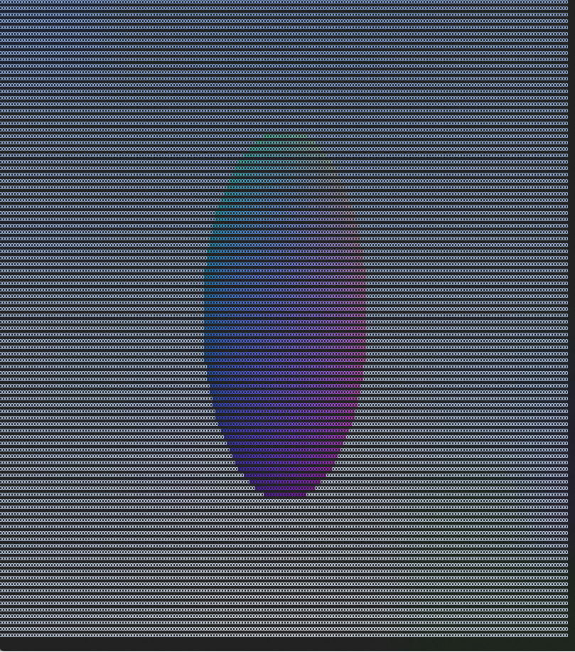
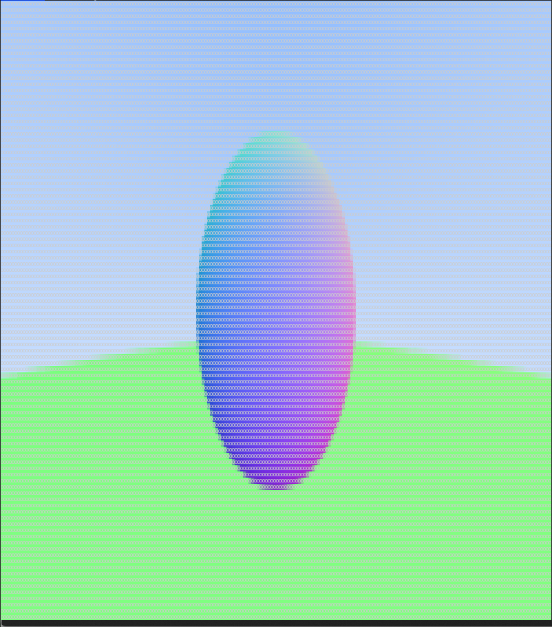

# occ  
   

# Overview  
Output Color characters to Console  

# Requirement  
C++17  
shell  
gcc or msvc or clang++  

## Usage  
compile and run!  

## Licence  
The source code is licensed MIT. The website content is licensed CC BY 4.0,see LICENSE.
